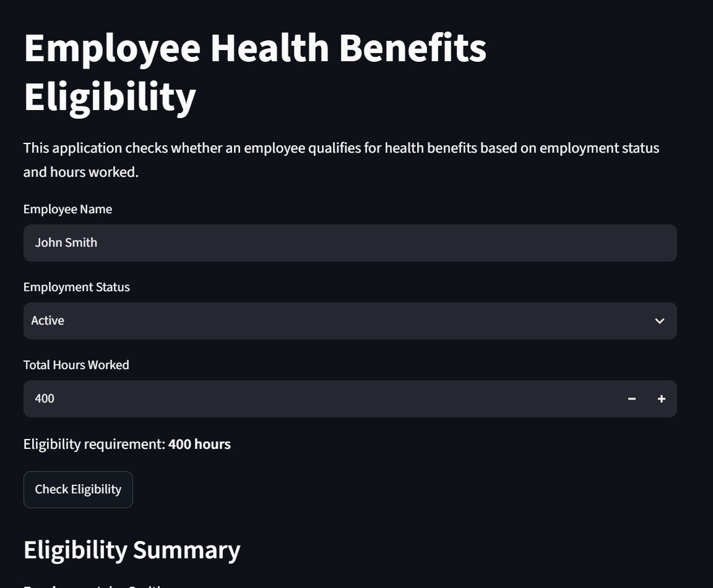

# Employee Health Benefits Eligibility Application

A Python application that determines whether an employee is eligible for health benefits based on employment status and hours worked.

## Features

- Checks employee eligibility based on a 400-hour requirement
- Verifies that the employee is actively employed
- Calculates remaining hours when an employee is not yet eligible
- Stores eligibility records in a SQLite database
- Displays previous eligibility checks in a history table
- Provides an interactive user interface using Streamlit

## Technologies Used

- Python
- Streamlit
- SQLite
- SQL
- Pandas

## Project Structure

- `app.py` - Streamlit user interface
- `eligibility.py` - Eligibility business logic
- `database.py` - Database operations
- `benefits.db` - Local SQLite database

## Eligibility Rules

An employee qualifies for health benefits when:

- The employee is actively employed
- The employee has worked at least 400 hours

If the employee has fewer than 400 hours, the application calculates how many additional hours are needed to qualify.

## Testing

The application was tested with multiple scenarios, including:

- Active employee with exactly 400 hours
- Active employee with 399 hours
- Active employee with more than 400 hours
- Inactive employee with more than 400 hours

Testing the 399-hour and 400-hour scenarios verifies that the eligibility boundary works correctly.
## Application Screenshot

